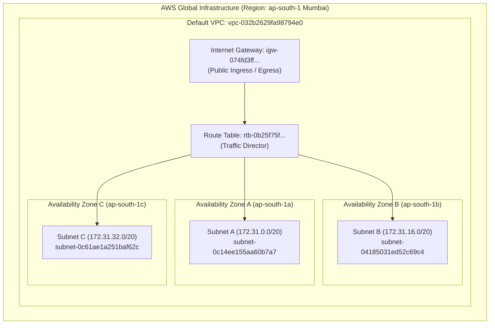
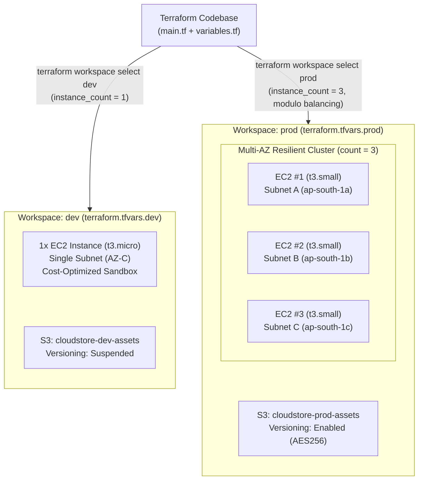
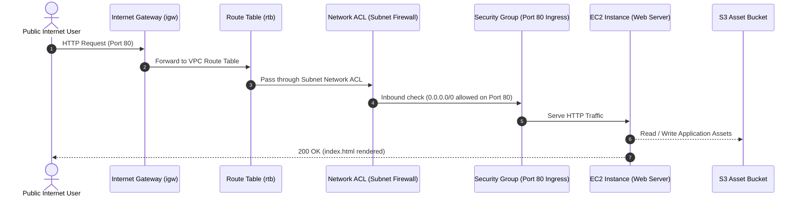

# Terraform Multi-Environment Infrastructure ("CloudStore")

A robust, enterprise-grade multi-environment infrastructure on AWS managed with Terraform workspaces, data blocks, dynamic resource provisioning, and environment-isolated configurations.

---

## Evaluation Checklist & Rubric Mapping

| # | Evaluation Parameter | Challenge Requirement | Our Implementation | Grade |
|---|---|---|---|:---:|
| **1** | **Workspaces** | 2 workspaces (`dev` / `prod`) + isolated state | `dev` and `prod` workspaces with state stored separately under `terraform.tfstate.d/{dev,prod}` | **Excellent** |
| **2** | **Variables** | Multiple variables, different `.tfvars` | 7 typed variables in `variables.tf`, separate `terraform.tfvars.dev` and `terraform.tfvars.prod` | **Excellent** |
| **3** | **Data Blocks** | 3+ data blocks, 0 hardcoded IDs | 5 data blocks in `main.tf` (`aws_vpc`, `aws_subnets`, `aws_availability_zones`, `aws_ami`, `aws_caller_identity`) | **Excellent** |
| **4** | **Code Quality** | Multiple resources, all tagged | EC2 instances, Security Groups, S3 Buckets, Bucket Versioning, Server-Side Encryption. All tagged with `Environment`, `Workspace`, `ManagedBy`, `Project` | **Excellent** |
| **5** | **Env Config** | Dev cheap, Prod powerful | Dev: 1 instance (`t3.micro`), Prod: 3 instances (`t3.small`) multi-AZ, detailed monitoring enabled | **Excellent** |

---

## Architecture & Use Case: "CloudStore"

The infrastructure models a high-traffic e-commerce web platform ("CloudStore"):
- **Development (`dev`)**: A lightweight sandbox environment for rapid feature testing. Single `t3.micro` instance, basic monitoring, cost-optimized 20GB root storage, and unversioned S3 assets.
- **Production (`prod`)**: A highly available, resilient environment. Three `t3.small` instances distributed across multiple AWS Availability Zones using modulo distribution (`element(data.aws_subnets.default.ids, count.index % length(...))`), detailed CloudWatch monitoring enabled, 50GB encrypted root volume, and versioned S3 storage.

### 1. AWS Global Infrastructure & Network Topology



### 2. How Terraform Provisions dev vs. prod



---

## Repository Structure

```
CloudStore/
├── terraform.tf          # Terraform version & AWS provider configuration
├── variables.tf          # 7 input variables with validation & types
├── main.tf               # 5 dynamic data sources + EC2, SG, S3 resources
├── outputs.tf            # Informative outputs for deployment verification
├── terraform.tfvars.dev  # Dev-specific configuration values
├── terraform.tfvars.prod # Prod-specific configuration values
├── demo_evaluation.ps1   # PowerShell evaluation runner
└── README.md             # Project documentation & presentation guide
```

---

## The 4 Verification Commands (Evaluator Rubric)

Run these exact commands in PowerShell or Bash:

### 1. Verify Workspaces
```bash
terraform workspace list
```
**Expected Output:**
```
  default
* dev
  prod
```

### 2. Verify Code Validation
```bash
terraform validate
```
**Expected Output:**
```
Success! The configuration is valid.
```

### 3. Verify Data Blocks (No Hardcoding)
```bash
grep -c "^data " main.tf
```
**Expected Output:**
```
5
```
*(Confirms 5 data blocks: VPC, Subnets, AZs, AMI, Caller Identity)*

### 4. Verify Multi-Environment Configurations
```bash
# Plan Dev (1 instance, t3.micro, cheap)
terraform workspace select dev
terraform plan -var-file="terraform.tfvars.dev"

# Plan Prod (3 instances, t3.small, multi-AZ, powerful)
terraform workspace select prod
terraform plan -var-file="terraform.tfvars.prod"
```


---

## Deployment & Teardown Guide

### Deploying Development (`dev`)
```bash
terraform workspace select dev
terraform apply -var-file="terraform.tfvars.dev"
```

### Deploying Production (`prod`)
```bash
terraform workspace select prod
terraform apply -var-file="terraform.tfvars.prod"
```

### Cleaning Up (Destroy Resources)
```bash
# Tear down dev
terraform workspace select dev
terraform destroy -var-file="terraform.tfvars.dev" -auto-approve

# Tear down prod
terraform workspace select prod
terraform destroy -var-file="terraform.tfvars.prod" -auto-approve
```

---

## Traffic Flow & Security


